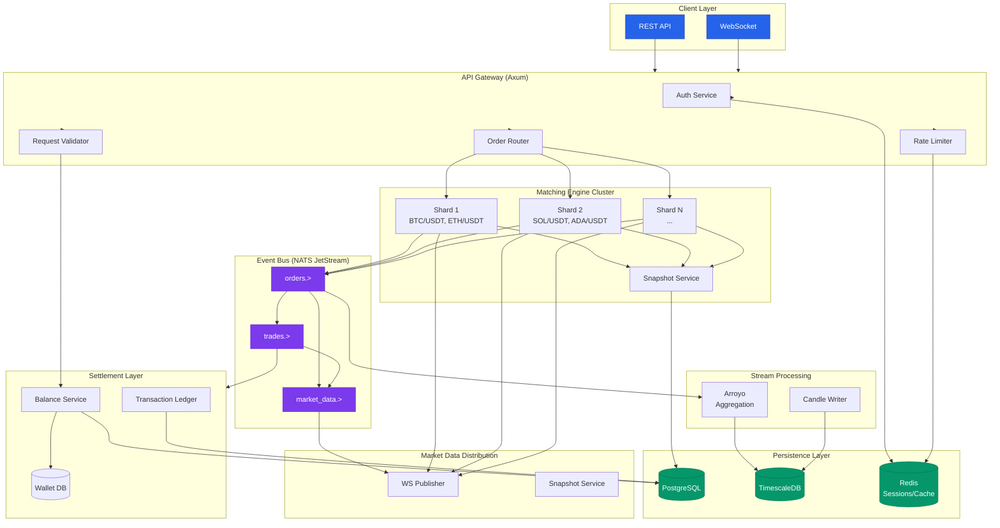
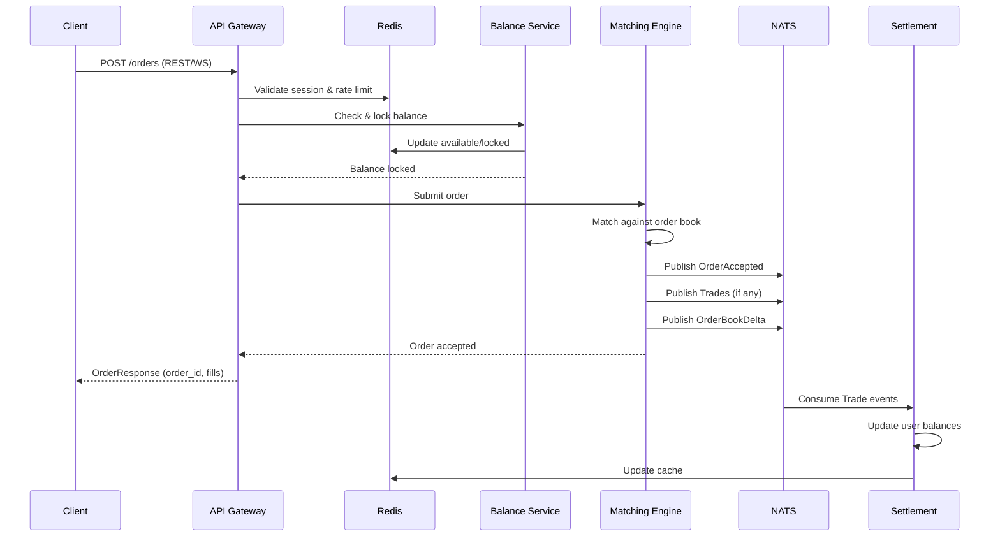
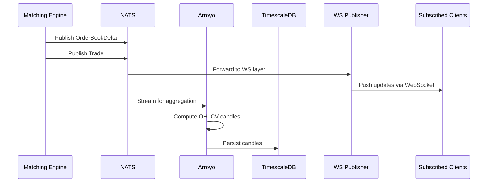

# CEX Matching Engine - Architecture Overview

## Executive Summary

This document outlines the architecture for a production-ready Centralized Exchange (CEX) Matching Engine supporting 500+ trading pairs with sub-millisecond latency and 100,000+ orders/second throughput.

## System Architecture



## Architectural Patterns

### CQRS (Command Query Responsibility Segregation)

The system separates **write operations** (commands) from **read operations** (queries):

| Aspect | Command Side | Query Side |
|--------|-------------|------------|
| Purpose | Mutate state | Read state |
| Database | PostgreSQL (source of truth) | Read replicas + Redis cache |
| Model | Normalized, consistent | Denormalized, optimized |
| Latency | Higher (ACID guaranteed) | Lower (eventual consistency OK) |
| Examples | Place order, cancel order, deposit | Get order book, get trade history |

**Application**:
- Commands flow through Matching Engine → Settlement → PostgreSQL
- Queries read from Redis (cached order books) or TimescaleDB (historical data)
- Market data is pushed proactively via WebSocket

### Event Sourcing

State changes are represented as an immutable sequence of events:

```
Order Placed → Order Accepted → Partial Fill → Partial Fill → Fully Filled → Order Closed
```

**Benefits**:
1. **Audit Trail**: Complete history of all state transitions
2. **Replayability**: Engine can be rebuilt from event stream
3. **Debugging**: Exact reproduction of any market scenario
4. **Analytics**: Event stream feeds downstream systems

**Event Storage**:
- NATS JetStream: Hot events (last 24-48 hours)
- PostgreSQL: Persistent event log (all history)

## Architectural Decision Records

### ADR-001: Rust as Primary Language

**Decision**: Use Rust for all critical-path services.

**Rationale**:
- Memory safety without GC pauses (critical for low latency)
- Zero-cost abstractions enable high-level code with bare-metal performance
- `rust_decimal` provides exact decimal arithmetic (no floating point errors)
- Tokio async runtime is battle-tested for high-concurrency workloads

**Alternatives Considered**:
- Go: GC pauses unacceptable for p99 < 500μs
- C++: Safety concerns, longer development time
- Java: GC and warm-up time issues

### ADR-002: NATS JetStream for Message Broker

**Decision**: Use NATS JetStream as the primary message broker.

**Rationale**:
- Sub-millisecond publish latency
- Built-in persistence (JetStream)
- Simple subject-based routing (vs. Kafka topic complexity)
- Lower operational overhead than Kafka
- Native Rust client with excellent performance

**Alternatives Considered**:
- Kafka: Overkill for our scale, higher latency
- Redis Streams: Limited durability guarantees
- RabbitMQ: Higher latency, AMQP complexity

### ADR-003: In-Memory Order Books with Periodic Snapshots

**Decision**: Maintain order books purely in memory with WAL + periodic snapshots.

**Rationale**:
- Order books must be accessed in < 100μs (database too slow)
- Memory structure: `BTreeMap<Price, VecDeque<Order>>`
- Write-Ahead Log to NATS for durability
- Snapshots every 1000 events or 30 seconds
- Recovery: Load snapshot + replay WAL

**Alternatives Considered**:
- Pure in-memory: Unacceptable data loss risk
- Database-backed: 10-100x slower, not production viable

### ADR-004: Sharding by Symbol

**Decision**: Each symbol (or small symbol group) gets its own dedicated engine thread.

**Rationale**:
- No cross-symbol contention
- Simple assignment: symbol → thread via hash
- Natural scaling: add more shards = more symbols
- One thread per shard eliminates lock overhead

**Trade-offs**:
- ✅ Pro: Lock-free within shard
- ❌ Con: Cannot share liquidity across shards
- ❌ Con: Imbalanced if one symbol dominates volume

### ADR-005: Separate Settlement from Matching

**Decision**: Matching Engine does NOT touch balances. Settlement Service handles all money.

**Rationale**:
- Separation of concerns: matching = price discovery, settlement = funds movement
- Engine can focus purely on order book mechanics
- Settlement can be throttled/queued without affecting matching
- Easier to audit and test

## Component Interaction Flow

### Order Placement Flow



### Market Data Flow



## Non-Functional Requirements

| Requirement | Target | Strategy |
|------------|--------|----------|
| Latency (matching) | p99 < 500μs | In-memory order books, single-threaded shards |
| Throughput | 100K orders/sec | Horizontal scaling of shards |
| Availability | 99.99% | Active-active with hot failover |
| Durability | Zero data loss | WAL + snapshots, consensus replication |
| Consistency | Strong | ACID for balances, deterministic matching |

## References

- [Service Breakdown](./01-services.md)
- [Matching Engine Core](./02-matching-engine.md)
- [Data Models](./03-data-models.md)
- [Event Flow](./04-events.md)
- [Fault Tolerance](./05-fault-tolerance.md)
- [Security](./06-security.md)
- [Observability](./07-observability.md)
- [Deployment](./08-deployment.md)
