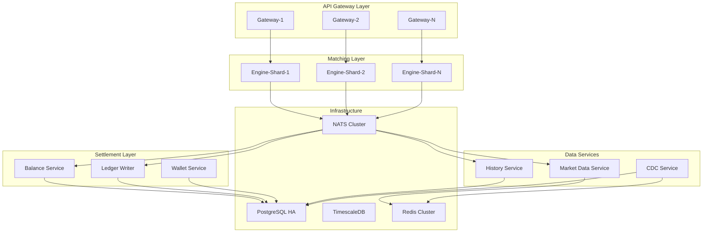

# Service Breakdown

## Microservice Architecture



## 1. API Gateway

**Purpose**: Entry point for all client requests. Handles authentication, rate limiting, request validation, and routing.

### Responsibilities

| Responsibility | Description |
|----------------|-------------|
| Authentication | JWT validation, session management |
| Rate Limiting | Per-IP and per-user throttling |
| Request Validation | Schema validation, business rule checks |
| Balance Locking | Reserve funds before order submission |
| Order Routing | Direct orders to correct engine shard |
| Response Formatting | Unified response format across clients |

### Technology Stack

```toml
[dependencies]
axum = "0.7"
tokio = { version = "1.35", features = ["full"] }
tower = "0.4"
tower-http = { version = "0.5", features = ["cors", "trace", "compression"] }
jsonwebtoken = "9.2"
redis = { version = "0.24", features = ["tokio-comp", "connection-manager"] }
sqlx = { version = "0.7", features = ["postgres", "runtime-tokio", "decimal"] }
rust_decimal = "1.32"
serde = { version = "1.0", features = ["derive"] }
serde_json = "1.0"
tracing = "0.1"
tracing-opentelemetry = "0.22"
```

### API Endpoints

#### REST Endpoints

```
POST   /api/v1/orders                 # Place order
DELETE /api/v1/orders/{order_id}      # Cancel order
POST   /api/v1/orders/batch-cancel    # Batch cancel
GET    /api/v1/orders/{order_id}      # Get order status
GET    /api/v1/orders                 # List open orders
GET    /api/v1/trades                 # Get trade history
GET    /api/v1/orderbook/{symbol}     # Get order book (snapshot)
GET    /api/v1/balance                # Get balances
GET    /api/v1/symbols                # List trading pairs
```

#### WebSocket Channels

```
# Authentication
> {"method": "auth", "params": {"token": "JWT"}}

# Order placement
> {"method": "order.place", "params": {...}}
< {"result": {"order_id": "...", "status": "open"}}

# Order cancellation
> {"method": "order.cancel", "params": {"order_id": "..."}}
< {"result": {"order_id": "...", "status": "cancelled"}}

# Subscribe to order book
> {"method": "subscribe", "params": ["orderbook:BTC/USDT"]}

# Subscribe to trades
> {"method": "subscribe", "params": ["trades:BTC/USDT"]}

# Order book updates (pushed)
< {"channel": "orderbook:BTC/USDT", "data": {...}}
```

### Scaling Strategy

- **Horizontal scaling**: Stateless design allows N instances behind load balancer
- **Connection-based routing**: WebSocket connections pinned to specific instance
- **CPU**: 2-4 cores per instance typically sufficient
- **Memory**: 512MB - 1GB per instance (minimal state)

---

## 2. Matching Engine (Sharded)

**Purpose**: Core matching engine that maintains order books and executes trades.

### Responsibilities

| Responsibility | Description |
|----------------|-------------|
| Order Book Management | Maintain bids/asks per symbol |
| Price-Time Matching | FIFO execution at same price |
| Trade Generation | Emit trades when orders match |
| Order Updates | Handle cancel, modify (decrease qty) |
| Snapshot Creation | Periodic order book snapshots |
| Event Publishing | Emit all events to NATS |

### Rust Crate Structure

```
matching-engine/
├── Cargo.toml
├── src/
│   ├── lib.rs              # Public API
│   ├── main.rs             # Binary entry
│   ├── engine/
│   │   ├── mod.rs
│   │   ├── order_book.rs   # OrderBook struct
│   │   ├── order.rs        # Order types
│   │   ├── trade.rs        # Trade generation
│   │   └── matching.rs     # Matching algorithm
│   ├── shard/
│   │   ├── mod.rs
│   │   ├── manager.rs      # Shard manager
│   │   └── processor.rs    # Per-shard event loop
│   ├── events/
│   │   ├── mod.rs
│   │   ├── publisher.rs    # NATS publisher
│   │   └── types.rs        # Event definitions
│   ├── snapshot/
│   │   ├── mod.rs
│   │   └── storage.rs      # Snapshot persistence
│   └── config.rs
```

### Key Data Structures

```rust
// src/engine/order.rs
use rust_decimal::Decimal;
use std::time::Instant;

#[derive(Debug, Clone)]
pub struct Order {
    pub id: u64,
    pub user_id: u64,
    pub symbol: String,
    pub side: Side,
    pub order_type: OrderType,
    pub price: Option<Decimal>,
    pub qty: Decimal,
    pub filled_qty: Decimal,
    pub fee_rate: Decimal,
    pub is_maker: bool,
    pub created_at: Instant,
    pub updated_at: Instant,
    pub time_in_force: TimeInForce,
}

#[derive(Debug, Clone, Copy, PartialEq, Eq)]
pub enum Side { Buy, Sell }

#[derive(Debug, Clone, Copy, PartialEq, Eq)]
pub enum OrderType {
    Limit,
    Market,
    IOC,        // Immediate-or-Cancel
    FOK,        // Fill-or-Kill
    PostOnly,   // Maker-Only
}

#[derive(Debug, Clone, Copy, PartialEq, Eq)]
pub enum TimeInForce {
    GTC,        // Good-Til-Cancelled
    IOC,        // Immediate-or-Cancel
    FOK,        // Fill-or-Kill
}

// src/engine/order_book.rs
use std::collections::{BTreeMap, VecDeque};

pub struct OrderBook {
    pub symbol: String,
    pub bids: BTreeMap<Decimal, PriceLevel>,  // Max-heap behavior (reverse iter)
    pub asks: BTreeMap<Decimal, PriceLevel>,  // Min-heap behavior (forward iter)
    pub best_bid: Option<Decimal>,
    pub best_ask: Option<Decimal>,
}

pub struct PriceLevel {
    pub price: Decimal,
    pub orders: VecDeque<Order>,
    pub total_qty: Decimal,
}

impl OrderBook {
    pub fn new(symbol: String) -> Self { ... }

    pub fn add_order(&mut self, order: Order) -> Result<(), EngineError> { ... }

    pub fn remove_order(&mut self, order_id: u64) -> Result<Option<Order>, EngineError> { ... }

    pub fn match_order(&mut self, mut order: Order) -> Vec<Trade> { ... }

    pub fn get_best_bid(&self) -> Option<Decimal> {
        self.bids.keys().rev().next().copied()
    }

    pub fn get_best_ask(&self) -> Option<Decimal> {
        self.asks.keys().next().copied()
    }

    pub fn get_spread(&self) -> Option<Decimal> {
        match (self.get_best_bid(), self.get_best_ask()) {
            (Some(bid), Some(ask)) => Some(ask - bid),
            _ => None,
        }
    }
}
```

### Sharding Strategy

Each engine instance manages **one or more symbols**:

```rust
// src/shard/manager.rs
use std::collections::HashMap;
use dashmap::DashMap;

pub struct ShardManager {
    shards: DashMap<Symbol, Shard>,
}

pub struct Shard {
    pub symbol: Symbol,
    pub order_book: OrderBook,
    pub sequence: u64,
    pub last_snapshot: Instant,
    pub event_count_since_snapshot: u64,
}

impl ShardManager {
    pub fn get_shard(&self, symbol: &str) -> &Shard {
        self.shards.get(symbol).unwrap()
    }

    pub fn submit_order(&self, symbol: &str, order: Order) -> Result<Vec<Trade>, EngineError> {
        let mut shard = self.shards.get_mut(symbol).unwrap();
        let trades = shard.order_book.match_order(order);
        shard.sequence += 1;
        Ok(trades)
    }
}
```

**Symbol Assignment**:
- Static allocation at startup
- Hot-reloadable via config
- Option: Dynamic rebalancing (advanced)

### Scaling Strategy

- **Per-symbol threading**: Each shard runs on its own thread
- **Multi-instance**: Run multiple engine processes, each with different symbol sets
- **CPU pinning**: Pin shard threads to dedicated CPU cores
- **Typical deployment**: 1 engine instance per 8-16 symbols (depends on volume)

---

## 3. Balance Service

**Purpose**: Manage user balances, lock funds for orders, settle trades.

### Responsibilities

| Responsibility | Description |
|----------------|-------------|
| Balance Locking | Reserve funds when order placed |
| Balance Settlement | Update balances after trade |
| Fee Calculation | Apply maker/taker fees |
| History Tracking | Maintain audit trail |

### Key Operations

```rust
use rust_decimal::Decimal;

pub struct Balance {
    pub user_id: u64,
    pub asset_id: u32,
    pub available: Decimal,
    pub locked: Decimal,
    pub total: Decimal,  // available + locked
}

pub struct BalanceService {
    db: PgPool,
    cache: RedisPool,
}

impl BalanceService {
    /// Lock funds for order placement
    pub async fn lock_funds(
        &self,
        user_id: u64,
        asset_id: u32,
        amount: Decimal,
        order_id: u64,
    ) -> Result<(), BalanceError> {
        // Check available balance
        // Subtract from available, add to locked
        // Update cache + DB (transaction)
    }

    /// Settle trade: move locked -> available (for received asset)
    pub async fn settle_received(
        &self,
        user_id: u64,
        asset_id: u32,
        amount: Decimal,
    ) -> Result<(), BalanceError> {
        // Add to available
    }

    /// Settle trade: release locked (for given asset)
    pub async fn settle_given(
        &self,
        user_id: u64,
        asset_id: u32,
        locked_amount: Decimal,
        actual_given: Decimal,
    ) -> Result<(), BalanceError> {
        // Subtract from locked
        // Refund remainder to available
    }
}
```

### Scaling Strategy

- **Horizontal scaling**: Stateless (cache + DB backed)
- **Sharding**: Can shard by user_id for very large scale
- **Typical**: 2-4 instances sufficient for 100K users

---

## 4. Ledger Writer

**Purpose**: Append-only log of all balance-changing transactions.

### Responsibilities

| Responsibility | Description |
|----------------|-------------|
| Transaction Logging | Record every balance change |
| Idempotency | Handle duplicate events |
| Reconciliation | Verify balance consistency |

### Table Schema

```sql
CREATE TABLE ledger_entries (
    id BIGSERIAL PRIMARY KEY,
    user_id BIGINT NOT NULL,
    asset_id SMALLINT NOT NULL,
    amount NUMERIC(30, 18) NOT NULL,
    balance_after NUMERIC(30, 18) NOT NULL,
    transaction_type VARCHAR(50) NOT NULL,
    reference_id BIGINT,  -- order_id, trade_id, etc.
    reference_type VARCHAR(50),
    created_at TIMESTAMPTZ NOT NULL DEFAULT NOW(),
    UNIQUE (reference_type, reference_id)  -- Idempotency
);

CREATE INDEX idx_ledger_user ON ledger_entries(user_id, created_at DESC);
```

---

## 5. Market Data Service

**Purpose**: Distribute order book snapshots and deltas to clients.

### Responsibilities

| Responsibility | Description |
|----------------|-------------|
| Snapshot Serving | Full order book snapshots |
| Delta Publishing | Incremental order book changes |
| Aggregation | Aggregate updates to reduce bandwidth |
| Throttling | Rate-limit for high-volume symbols |

### WebSocket Message Format

```rust
// Order book snapshot
pub struct OrderBookSnapshot {
    pub symbol: String,
    pub bids: Vec<(Decimal, Decimal)>,  // (price, qty)
    pub asks: Vec<(Decimal, Decimal)>,
    pub sequence: u64,
    pub timestamp: i64,
}

// Order book delta
pub struct OrderBookDelta {
    pub symbol: String,
    pub bids: Vec<DeltaUpdate>,
    pub asks: Vec<DeltaUpdate>,
    pub sequence: u64,
    pub timestamp: i64,
}

pub enum DeltaUpdate {
    Add { price: Decimal, qty: Decimal },
    Update { price: Decimal, qty: Decimal },
    Delete { price: Decimal },
}
```

### Optimization Strategies

1. **Snapshot on Demand**: Send full snapshot on subscribe
2. **Delta Updates**: Push only changes thereafter
3. **Merge Batches**: Aggregate multiple updates within 10ms window
4. **Compression**: Use MessagePack or gzip for high-volume symbols
5. **Selective Publishing**: Top 10 levels vs full book

---

## 6. History Service

**Purpose**: Query service for order history, trade history, fills.

### Responsibilities

| Responsibility | Description |
|----------------|-------------|
| Order History | User's past orders |
| Trade History | User's past trades |
| Public Trades | Recent trades for symbol |
| Pagination | Efficient cursor-based pagination |

### API Endpoints

```
GET /api/v1/history/orders
  ?user_id={uid}
  &symbol={BTC/USDT}
  &status={open,filled,cancelled}
  &limit=100
  &after={cursor}

GET /api/v1/history/trades
  ?user_id={uid}
  &symbol={BTC/USDT}
  &limit=100
  &after={cursor}

GET /api/v1/trades/{symbol}
  ?limit=100
  &after={cursor}
```

---

## 7. Wallet Service

**Purpose**: Manage deposit/withdraw addresses and blockchain interactions.

### Responsibilities

| Responsibility | Description |
|----------------|-------------|
| Address Generation | Create deposit addresses |
| Balance Sync | Sync on-chain balances |
| Withdrawal Processing | Broadcast transactions |
| Transaction Monitoring | Track confirmations |

---

## Service Communication Matrix

| From | To | Protocol | Purpose |
|------|-----|----------|---------|
| API Gateway | Balance Service | gRPC | Lock/check funds |
| API Gateway | Matching Engine | gRPC | Submit orders |
| API Gateway | Redis | TCP | Session/cache |
| Matching Engine | NATS | TCP | Publish events |
| Balance Service | NATS | TCP | Subscribe trades |
| Balance Service | PostgreSQL | PQ | Persist state |
| Market Data | NATS | TCP | Subscribe events |
| Market Data | Redis | TCP | Cache snapshots |
| Client | API Gateway | REST/WS | User requests |

---

## Deployment Topology

```
┌─────────────────────────────────────────────────────────────────┐
│                         Load Balancer                            │
└─────────────────────────────────────────────────────────────────┘
            │                    │                    │
    ┌───────▼──────┐    ┌───────▼──────┐    ┌───────▼──────┐
    │  Gateway-1   │    │  Gateway-2   │    │  Gateway-N   │
    └──────────────┘    └──────────────┘    └──────────────┘
            │                    │                    │
    ┌───────▼────────────────────▼────────────────────▼───────┐
    │                    NATS JetStream Cluster                │
    └──────────────────────────────────────────────────────────┘
            │                                    │
    ┌───────▼──────┐                    ┌───────▼─────────────┐
    │  Engine-1    │                    │  Balance Services   │
    │  (Shards     │                    └─────────────────────┘
    │   1-100)     │                              │
    └──────────────┘                    ┌────────▼─────────────┐
    │  Engine-2    │                    │  PostgreSQL HA       │
    │  (Shards     │                    │  (Primary + Replica) │
    │  101-200)    │                    └──────────────────────┘
    └──────────────┘                              │
    │  Engine-N    │                    ┌────────▼─────────────┐
    │  (Shards     │                    │  TimescaleDB         │
    │   201-300)   │                    └──────────────────────┘
    └──────────────┘
```
