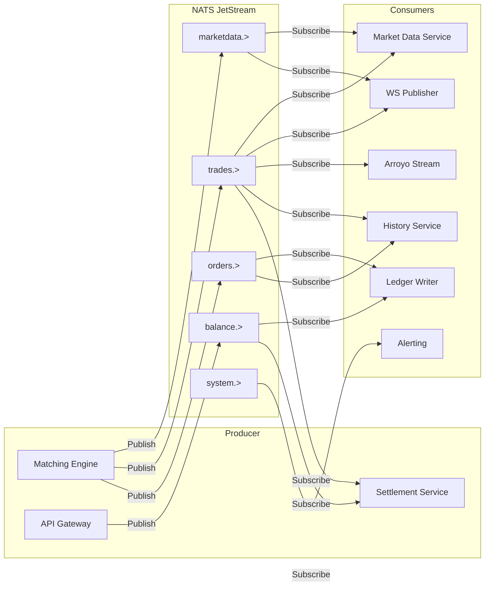

# Event Flow & Message Contracts

## Event Flow Architecture



## Event Types

### 1. Order Events

| Event | Subject | Payload | Purpose |
|-------|---------|---------|---------|
| OrderPlaced | `orders.{pair_id}.placed` | Order details | Order accepted by gateway |
| OrderAccepted | `orders.{pair_id}.accepted` | Order ID, sequence | Order in engine |
| OrderFilled | `orders.{pair_id}.filled` | Order ID, filled qty | Order fully filled |
| OrderPartiallyFilled | `orders.{pair_id}.partial_fill` | Order ID, fill qty | Partial execution |
| OrderCancelled | `orders.{pair_id}.cancelled` | Order ID, reason | Order cancelled |
| OrderRejected | `orders.{pair_id}.rejected` | Order ID, reason | Order rejected |
| OrderExpired | `orders.{pair_id}.expired` | Order ID | TTL-based expiry |

### 2. Trade Events

| Event | Subject | Payload | Purpose |
|-------|---------|---------|---------|
| TradeExecuted | `trades.{pair_id}` | Full trade details | Trade executed |
| TradeReversed | `trades.{pair_id}.reversed` | Trade ID, reason | Trade reversal (rare) |

### 3. Market Data Events

| Event | Subject | Payload | Purpose |
|-------|---------|---------|---------|
| OrderBookSnapshot | `marketdata.orderbook.{pair_id}.snapshot` | Full order book | Initial sync |
| OrderBookDelta | `marketdata.orderbook.{pair_id}.delta` | Changes only | Incremental updates |
| Ticker24h | `marketdata.ticker.{pair_id}.24h` | 24h statistics | Ticker display |
| PriceUpdate | `marketdata.price.{pair_id}` | Latest price | Price feed |

### 4. Balance Events

| Event | Subject | Payload | Purpose |
|-------|---------|---------|---------|
| BalanceLocked | `balance.{user_id}.lock` | Asset, amount | Funds locked |
| BalanceUnlocked | `balance.{user_id}.unlock` | Asset, amount | Funds released |
| BalanceUpdated | `balance.{user_id}.{asset_id}.updated` | New balances | Balance change |

### 5. System Events

| Event | Subject | Payload | Purpose |
|-------|---------|---------|---------|
| ShardStarted | `engine.{shard_id}.started` | Shard info | Shard initialization |
| SnapshotCreated | `engine.{shard_id}.snapshot.created` | Metadata | Snapshot complete |
| SnapshotRestored | `engine.{shard_id}.snapshot.restored` | Metadata | Recovery complete |
| EngineError | `engine.{shard_id}.error` | Error details | Error alerting |

## Event Contracts (JSON Schema)

### OrderPlaced Event

```json
{
  "$schema": "http://json-schema.org/draft-07/schema#",
  "type": "object",
  "title": "OrderPlaced",
  "description": "Emitted when an order is accepted by the API Gateway",
  "required": ["type", "order", "timestamp"],
  "properties": {
    "type": {
      "type": "string",
      "const": "order.placed"
    },
    "order": {
      "type": "object",
      "required": ["id", "user_id", "pair_id", "side", "order_type", "qty"],
      "properties": {
        "id": {"type": "string"},
        "user_id": {"type": "integer"},
        "pair_id": {"type": "integer"},
        "symbol": {"type": "string"},
        "side": {"enum": ["bid", "ask"]},
        "order_type": {"enum": ["limit", "market", "ioc", "fok", "post_only"]},
        "time_in_force": {"enum": ["gtc", "ioc", "fok"]},
        "price": {"type": "string", "pattern": "^[0-9]+(\\.[0-9]+)?$"},
        "qty": {"type": "string", "pattern": "^[0-9]+(\\.[0-9]+)?$"},
        "post_only": {"type": "boolean"},
        "client_order_id": {"type": "string"}
      }
    },
    "fee_rates": {
      "type": "object",
      "properties": {
        "maker": {"type": "string"},
        "taker": {"type": "string"}
      }
    },
    "timestamp": {"type": "integer", "description": "Unix milliseconds"}
  }
}
```

### TradeExecuted Event

```json
{
  "$schema": "http://json-schema.org/draft-07/schema#",
  "type": "object",
  "title": "TradeExecuted",
  "description": "Emitted when a trade is executed",
  "required": ["type", "trade", "sequence", "timestamp"],
  "properties": {
    "type": {
      "type": "string",
      "const": "trade.executed"
    },
    "trade": {
      "type": "object",
      "required": [
        "id", "pair_id", "maker_order_id", "taker_order_id",
        "maker_user_id", "taker_user_id", "price", "qty"
      ],
      "properties": {
        "id": {"type": "string"},
        "pair_id": {"type": "integer"},
        "symbol": {"type": "string"},
        "maker_order_id": {"type": "string"},
        "taker_order_id": {"type": "string"},
        "maker_user_id": {"type": "integer"},
        "taker_user_id": {"type": "integer"},
        "side": {"enum": ["bid", "ask"]},
        "price": {"type": "string"},
        "qty": {"type": "string"},
        "maker_fee": {"type": "string"},
        "taker_fee": {"type": "string"}
      }
    },
    "sequence": {"type": "integer"},
    "shard_id": {"type": "integer"},
    "timestamp": {"type": "integer"}
  }
}
```

### OrderBookDelta Event

```json
{
  "$schema": "http://json-schema.org/draft-07/schema#",
  "type": "object",
  "title": "OrderBookDelta",
  "description": "Incremental order book update",
  "required": ["type", "pair_id", "sequence", "timestamp"],
  "properties": {
    "type": {
      "type": "string",
      "const": "orderbook.delta"
    },
    "pair_id": {"type": "integer"},
    "symbol": {"type": "string"},
    "sequence": {"type": "integer"},
    "bids": {
      "type": "object",
      "description": "Price -> Qty (0 = delete)",
      "additionalProperties": {"type": "string"}
    },
    "asks": {
      "type": "object",
      "description": "Price -> Qty (0 = delete)",
      "additionalProperties": {"type": "string"}
    },
    "timestamp": {"type": "integer"}
  }
}
```

## Event Sequencing & Ordering

### Sequence Number Assignment

```rust
// Each shard maintains its own sequence number
pub struct Shard {
    pub sequence: AtomicU64,
    // ...
}

impl Shard {
    pub fn next_sequence(&self) -> u64 {
        self.sequence.fetch_add(1, Ordering::SeqCst)
    }
}
```

### Ordering Guarantees

| Consumer | Guarantee | Strategy |
|----------|-----------|----------|
| Matching Engine | Strict per-shard ordering | Single-threaded processing |
| Settlement | Per-trade ordering | Consume from trades subject |
| Market Data | Per-symbol ordering | Use sequence numbers |
| History | Eventually consistent | Use NATS JetStream ACK |

### NATS JetStream Configuration

```rust
// Consumer configuration for ordered delivery
let consumer_config = ConsumerConfig {
    name: "settlement-consumer".to_string(),
    deliver_policy: DeliverPolicy::All,
    ack_policy: AckPolicy::Explicit,
    replay_policy: ReplayPolicy::Instant,
    max_deliver: 3,  // Retry 3 times before NAK
    filter_subject: "trades.>".to_string(),
    ..Default::default()
};
```

## Message Processing Patterns

### 1. At-Least-Once Delivery

NATS JetStream guarantees at-least-once delivery. Consumers must be idempotent:

```rust
pub struct IdempotentTradeProcessor {
    processed: HashSet<u64>,  // In-memory set of processed trade IDs
}

impl IdempotentTradeProcessor {
    pub async fn process_trade(&mut self, trade: &Trade) -> Result<(), Error> {
        // Check if already processed
        if self.processed.contains(&trade.id) {
            return Ok(());  // Duplicate, skip
        }

        // Process trade
        self.execute_trade(trade).await?;

        // Mark as processed
        self.processed.insert(trade.id);

        Ok(())
    }
}
```

### 2. Exactly-Once via Idempotency Keys

```rust
pub struct SettlementService {
    db: PgPool,
}

impl SettlementService {
    pub async fn settle_trade(&self, trade: &Trade) -> Result<(), Error> {
        // Use database constraint to enforce idempotency
        query!(
            r#"
            INSERT INTO ledger_entries (user_id, asset_id, amount, balance_after, transaction_type, reference_id, reference_type)
            SELECT $1, $2, $3, $4, 'trade_fill', $5, 'trade'
            ON CONFLICT (reference_type, reference_id) DO NOTHING
            "#,
            trade.maker_user_id,
            asset_id,
            amount,
            balance_after,
            trade.id
        )
        .execute(&self.db)
        .await?;

        Ok(())
    }
}
```

### 3. Outbox Pattern

For operations that must be atomic across database and message broker:

```sql
CREATE TABLE outbox (
    id BIGSERIAL PRIMARY KEY,
    event_type VARCHAR(100) NOT NULL,
    payload JSONB NOT NULL,
    subject VARCHAR(255) NOT NULL,
    status VARCHAR(20) NOT NULL DEFAULT 'pending',  -- pending, published, failed
    created_at TIMESTAMPTZ NOT NULL DEFAULT NOW(),
    published_at TIMESTAMPTZ
);

CREATE INDEX idx_outbox_status ON outbox(status, created_at);
```

```rust
// In a transaction
async fn place_order_with_outbox(
    db: &PgPool,
    order: &Order,
) -> Result<u64, Error> {
    let mut tx = db.begin().await?;

    // Insert order
    let order_id = query_scalar::<_, i64>(
        "INSERT INTO orders (...) VALUES (...) RETURNING id"
    )
    .fetch_one(&mut *tx)
    .await?;

    // Insert outbox event
    query!(
        r#"
        INSERT INTO outbox (event_type, payload, subject)
        VALUES ($1, $2, $3)
        "#,
        "order.placed",
        json!({"order_id": order_id, ...}),
        format!("orders.{}.placed", order.pair_id)
    )
    .execute(&mut *tx)
    .await?;

    tx.commit().await?;

    Ok(order_id)
}

// Background worker publishes outbox events
async fn outbox_worker(db: PgPool, nats: async_nats::Client) {
    loop {
        let events = query!(
            r#"
            SELECT id, event_type, payload, subject
            FROM outbox
            WHERE status = 'pending'
            ORDER BY created_at
            LIMIT 100
            "#
        )
        .fetch_all(&db)
        .await?;

        for event in events {
            match nats.publish(event.subject, event.payload.to_string().into()).await {
                Ok(_) => {
                    query!("UPDATE outbox SET status = 'published', published_at = NOW() WHERE id = $1", event.id)
                        .execute(&db)
                        .await?;
                }
                Err(e) => {
                    error!("Failed to publish outbox event {}: {}", event.id, e);
                    query!("UPDATE outbox SET status = 'failed' WHERE id = $1", event.id)
                        .execute(&db)
                        .await?;
                }
            }
        }

        tokio::time::sleep(Duration::from_millis(100)).await;
    }
}
```

## Event Replay Strategy

### WAL (Write-Ahead Log) Format

```rust
#[derive(Debug, Clone, Serialize, Deserialize)]
pub enum WALEntry {
    OrderAdded {
        sequence: u64,
        order: Order,
    },
    OrderRemoved {
        sequence: u64,
        order_id: u64,
        reason: RemoveReason,
    },
    TradeExecuted {
        sequence: u64,
        trade: Trade,
    },
}
```

### Snapshot + WAL Recovery

```rust
pub struct OrderBookRecovery {
    snapshot_path: PathBuf,
    wal_path: PathBuf,
}

impl OrderBookRecovery {
    pub async fn recover(&self) -> Result<OrderBook, Error> {
        // 1. Load latest snapshot
        let mut order_book = self.load_snapshot().await?;

        // 2. Replay WAL entries since snapshot
        let wal_entries = self.load_wal_since(order_book.sequence).await?;

        for entry in wal_entries {
            match entry {
                WALEntry::OrderAdded { order, .. } => {
                    order_book.add_order(order)?;
                }
                WALEntry::OrderRemoved { order_id, .. } => {
                    order_book.cancel_order(order_id)?;
                }
                WALEntry::TradeExecuted { trade, .. } => {
                    // Trades are result of matching, already reflected in book
                    // Just update sequence
                    order_book.sequence = trade.sequence;
                }
            }
        }

        Ok(order_book)
    }
}
```

## NATS JetStream Stream Configuration

```rust
use async_nats::jetstream;

async fn setup_streams(js: &jetstream::Context) -> Result<(), Error> {
    // Orders stream
    let orders_stream = jetstream::stream::Config {
        name: "ORDERS".to_string(),
        subjects: vec!["orders.>".to_string()],
        retention: jetstream::stream::RetentionPolicy::WorkQueue,
        max_age: std::time::Duration::from_secs(48 * 3600),  // 48 hours
        max_bytes: 10 * 1024 * 1024 * 1024,  // 10GB
        max_msg_size: 1024 * 1024,  // 1MB
        storage: jetstream::stream::StorageType::File,
        num_replicas: 3,
        ..Default::default()
    };
    js.create_stream(orders_stream).await?;

    // Trades stream
    let trades_stream = jetstream::stream::Config {
        name: "TRADES".to_string(),
        subjects: vec!["trades.>".to_string()],
        retention: jetstream::stream::RetentionPolicy::WorkQueue,
        max_age: std::time::Duration::from_secs(7 * 24 * 3600),  // 7 days
        max_bytes: 50 * 1024 * 1024 * 1024,  // 50GB
        storage: jetstream::stream::StorageType::File,
        num_replicas: 3,
        ..Default::default()
    };
    js.create_stream(trades_stream).await?;

    // Market data stream
    let market_stream = jetstream::stream::Config {
        name: "MARKETDATA".to_string(),
        subjects: vec!["marketdata.>".to_string()],
        retention: jetstream::stream::RetentionPolicy::WorkQueue,
        max_age: std::time::Duration::from_secs(24 * 3600),  // 24 hours
        max_bytes: 100 * 1024 * 1024 * 1024,  // 100GB (high volume)
        max_msg_size: 2 * 1024 * 1024,  // 2MB (large order books)
        storage: jetstream::stream::StorageType::File,
        num_replicas: 2,  // Less critical, can tolerate data loss
        ..Default::default()
    };
    js.create_stream(market_stream).await?;

    // Balance stream
    let balance_stream = jetstream::stream::Config {
        name: "BALANCE".to_string(),
        subjects: vec!["balance.>".to_string()],
        retention: jetstream::stream::RetentionPolicy::WorkQueue,
        max_age: std::time::Duration::from_secs(30 * 24 * 3600),  // 30 days
        storage: jetstream::stream::StorageType::File,
        num_replicas: 3,
        ..Default::default()
    };
    js.create_stream(balance_stream).await?;

    Ok(())
}
```

## Consumer Implementation Examples

### Settlement Service Consumer

```rust
use async_nats::jetstream::consumer;

pub struct SettlementConsumer {
    js: jetstream::Context,
    db: PgPool,
}

impl SettlementConsumer {
    pub async fn run(&self) -> Result<(), Error> {
        // Create durable consumer
        let consumer_config = consumer::push::Config {
            durable_name: Some("settlement-service".to_string()),
            deliver_subject: Some("settlement.inbox".to_string()),
            ack_policy: consumer::AckPolicy::Explicit,
            ack_wait: std::time::Duration::from_secs(30),
            max_deliver: 3,
            filter_subject: "trades.>".to_string(),
            ..Default::default()
        };

        let stream = self.js.get_stream("TRADES").await?;
        let consumer = stream.create_consumer("settlement", &consumer_config).await?;

        // Subscribe to messages
        let mut messages = consumer.messages().await?;

        while let Some(message) = messages.next().await {
            match message {
                Ok(msg) => {
                    if let Err(e) = self.handle_trade(&msg).await {
                        error!("Failed to handle trade: {}", e);
                        // NAK to trigger retry
                        msg.nack().await?;
                    } else {
                        msg.ack().await?;
                    }
                }
                Err(e) => {
                    error!("Stream error: {}", e);
                    break;
                }
            }
        }

        Ok(())
    }

    async fn handle_trade(&self, msg: &Message) -> Result<(), Error> {
        let trade: Trade = serde_json::from_slice(&msg.payload)?;

        // Settlement logic
        self.settle_trade(&trade).await?;

        Ok(())
    }
}
```

## Performance Considerations

### Batch Processing

```rust
// Process messages in batches for efficiency
pub async fn process_trades_batched(&self, limit: usize) -> Result<(), Error> {
    let mut messages = self.consumer.fetch(limit).await?;

    for msg in messages.try_iter() {
        // Process message
    }

    // Ack all at once
    for msg in messages {
        msg.ack().await?;
    }

    Ok(())
}
```

### Flow Control

```rust
// Configure pending limits to prevent memory issues
let consumer_config = consumer::Config {
    max_pending: 1000,
    max_ack_pending: 500,
    ..Default::default()
};
```

## Monitoring & Observability

### NATS Metrics

| Metric | Type | Description |
|--------|------|-------------|
| `nats.messages_in` | Counter | Messages received |
| `nats.messages_out` | Counter | Messages published |
| `nats.message_errors` | Counter | Processing failures |
| `nats.consumer_lag` | Gauge | Unprocessed messages |
| `nats.stream_bytes` | Gauge | Stream storage usage |
| `nats.ack_latency_ms` | Histogram | Time to ACK message |

### Alerting Rules

```yaml
alerts:
  - name: HighConsumerLag
    condition: nats.consumer_lag > 10000
    severity: warning

  - name: ProcessingFailed
    condition: rate(nats.message_errors[5m]) > 10
    severity: critical

  - name: StreamNearlyFull
    condition: nats.stream_bytes / nats.stream_max_bytes > 0.9
    severity: critical
```
