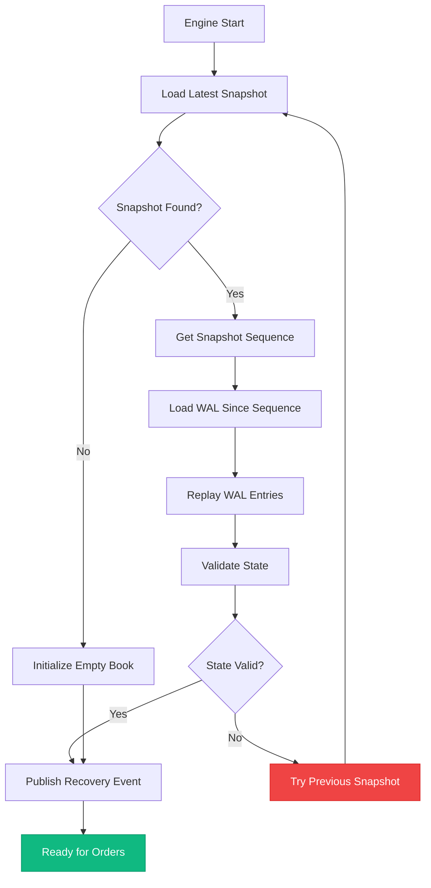
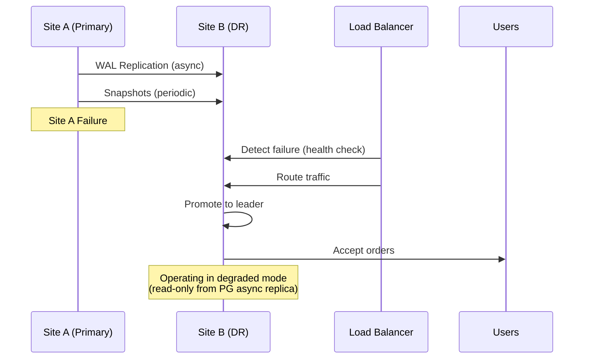

# Fault Tolerance & Recovery

## Overview

The matching engine must handle failures gracefully with **zero data loss** and **fast recovery**. This document outlines the fault tolerance strategy.

## Threat Model

| Failure Type | Likelihood | Impact | Strategy |
|--------------|------------|--------|----------|
| Process crash | Medium | High | Snapshot + WAL replay |
| Server power loss | Low | High | Snapshot + WAL replay |
| Network partition | Low | Medium | Leader election |
| Database failure | Low | High | PostgreSQL HA |
| NATS failure | Low | High | NATS clustering |
| Corrupted data | Very Low | Critical | Multiple snapshots |

## High Availability Architecture

```mermaid
flowchart TB
    subgraph Primary["Primary Region"]
        PG1[(("PG Primary")]
        PG2[(("PG Standby")]
        NATS1["NATS Node 1"]
        NATS2["NATS Node 2"]
        NATS3["NATS Node 3"]
        ME1["Engine Primary"]
        ME2["Engine Standby"]
    end

    subgraph Secondary["DR Region"]
        PG3[(("PG Async Standby")]
        NATS4["NATS Node 4"]
        NATS5["NATS Node 5"]
        ME3["Engine DR Standby"]
    end

    PG1 -.-> PG2
    PG1 -.-> PG3

    NATS1 <--> NATS2
    NATS2 <--> NATS3
    NATS1 -.-> NATS4
    NATS4 <--> NATS5

    ME1 <--> ME2
    ME1 -.-> ME3

    ME1 --> NATS1
    ME2 --> NATS2
    ME3 --> NATS4

    classDef ha fill:#10b981,stroke:#059669,color:#fff
    classDef dr fill:#f59e0b,stroke:#d97706,color:#fff

    class PG1,PG2,NATS1,NATS2,NATS3,ME1,ME2 ha
    class PG3,NATS4,NATS5,ME3 dr
```

## Snapshot Strategy

### Snapshot Format

```rust
#[derive(Debug, Clone, Serialize, Deserialize)]
pub struct OrderBookSnapshot {
    pub symbol: String,
    pub sequence: u64,
    pub bids: Vec<(Decimal, VecDeque<Order>)>,
    pub asks: Vec<(Decimal, VecDeque<Order>)>,
    pub timestamp: i64,
    pub version: u32,
}

#[derive(Debug, Clone, Serialize, Deserialize)]
pub struct SnapshotMetadata {
    pub shard_id: u32,
    pub sequence: u64,
    pub event_count: u64,
    pub created_at: i64,
    pub size_bytes: usize,
}
```

### Snapshot Triggers

Snapshots are created when any of these conditions are met:

1. **Event count threshold**: Every 1,000 events
2. **Time threshold**: Every 30 seconds
3. **Manual trigger**: Admin command
4. **Before shutdown**: Graceful shutdown

```rust
pub struct SnapshotManager {
    last_snapshot_sequence: u64,
    event_count_since_snapshot: u64,
    last_snapshot_time: Instant,
    snapshot_interval_events: u64,
    snapshot_interval_duration: Duration,
}

impl SnapshotManager {
    pub fn should_snapshot(&self, current_sequence: u64) -> bool {
        let events_since = current_sequence - self.last_snapshot_sequence;

        events_since >= self.snapshot_interval_events
            || self.last_snapshot_time.elapsed() >= self.snapshot_interval_duration
    }

    pub async fn create_snapshot(
        &mut self,
        order_book: &OrderBook,
        storage: &SnapshotStorage,
    ) -> Result<SnapshotMetadata, Error> {
        let snapshot = order_book.to_snapshot();
        let metadata = storage.save(&snapshot).await?;

        self.last_snapshot_sequence = snapshot.sequence;
        self.event_count_since_snapshot = 0;
        self.last_snapshot_time = Instant::now();

        Ok(metadata)
    }
}
```

### Snapshot Storage

```rust
#[async_trait]
pub trait SnapshotStorage: Send + Sync {
    async fn save(&self, snapshot: &OrderBookSnapshot) -> Result<SnapshotMetadata, Error>;
    async fn load_latest(&self, symbol: &str) -> Result<Option<OrderBookSnapshot>, Error>;
    async fn list_snapshots(&self, symbol: &str) -> Result<Vec<SnapshotMetadata>, Error>;
    async fn delete_old_snapshots(&self, symbol: &str, retain: usize) -> Result<(), Error>;
}

// PostgreSQL-based storage
pub struct PostgresSnapshotStorage {
    pool: PgPool,
}

#[async_trait]
impl SnapshotStorage for PostgresSnapshotStorage {
    async fn save(&self, snapshot: &OrderBookSnapshot) -> Result<SnapshotMetadata, Error> {
        let data = serde_json::to_vec(snapshot)?;
        let metadata = query_scalar::<_, i64>(
            r#"
            INSERT INTO order_book_snapshots (symbol, sequence, data, created_at)
            VALUES ($1, $2, $3, NOW())
            RETURNING id
            "#,
        )
        .bind(&snapshot.symbol)
        .bind(snapshot.sequence as i64)
        .bind(&data)
        .fetch_one(&self.pool)
        .await?;

        Ok(SnapshotMetadata {
            shard_id: 0,
            sequence: snapshot.sequence,
            event_count: 0,
            created_at: snapshot.timestamp,
            size_bytes: data.len(),
        })
    }

    async fn load_latest(&self, symbol: &str) -> Result<Option<OrderBookSnapshot>, Error> {
        let row = query_opt(
            r#"
            SELECT data, sequence
            FROM order_book_snapshots
            WHERE symbol = $1
            ORDER BY sequence DESC
            LIMIT 1
            "#,
        )
        .bind(symbol)
        .fetch_optional(&self.pool)
        .await?;

        match row {
            Some((data, _)) => {
                let snapshot: OrderBookSnapshot = serde_json::from_slice(&data)?;
                Ok(Some(snapshot))
            }
            None => Ok(None),
        }
    }
}
```

## Write-Ahead Log (WAL)

### WAL Structure

```rust
#[derive(Debug, Clone, Serialize, Deserialize)]
pub enum WALEntry {
    OrderAdded {
        sequence: u64,
        order: Order,
    },
    OrderRemoved {
        sequence: u64,
        order_id: u64,
        remaining_qty: Decimal,
        reason: RemoveReason,
    },
    OrderUpdated {
        sequence: u64,
        order_id: u64,
        new_qty: Decimal,
    },
    TradeExecuted {
        sequence: u64,
        trade: Trade,
    },
}

#[derive(Debug, Clone, Serialize, Deserialize)]
pub enum RemoveReason {
    Cancelled,
    Filled,
    IOCExpired,
    FOKNoFill,
    AdminCancel,
}
```

### WAL Publishing

```rust
pub struct WALPublisher {
    nats: async_nats::Client,
    subject_prefix: String,
}

impl WALPublisher {
    pub async fn publish(&self, entry: &WALEntry) -> Result<(), Error> {
        let subject = match entry {
            WALEntry::OrderAdded { sequence, .. } => {
                format!("{}.orders.add.{}", self.subject_prefix, sequence)
            }
            WALEntry::OrderRemoved { sequence, .. } => {
                format!("{}.orders.remove.{}", self.subject_prefix, sequence)
            }
            // ...
        };

        let payload = serde_json::to_vec(entry)?;
        self.nats.publish(subject, payload.into()).await?;
        Ok(())
    }
}
```

### NATS JetStream for WAL Persistence

```rust
pub async fn setup_wal_stream(js: &jetstream::Context, shard_id: u32) -> Result<(), Error> {
    let stream_config = jetstream::stream::Config {
        name: format!("WAL_{}", shard_id),
        subjects: vec![format!("shard.{}.>", shard_id)],
        retention: jetstream::stream::RetentionPolicy::WorkQueue,
        max_age: std::time::Duration::from_secs(24 * 3600),  // 24 hours
        max_bytes: 10 * 1024 * 1024 * 1024,  // 10GB
        storage: jetstream::stream::StorageType::File,
        num_replicas: 3,
        duplicate_window: std::time::Duration::from_secs(120),
        ..Default::default()
    };

    js.create_stream(stream_config).await?;

    Ok(())
}
```

## Recovery Process

### Recovery Flow



### Recovery Implementation

```rust
pub struct RecoveryManager {
    snapshot_storage: Arc<dyn SnapshotStorage>,
    wal_consumer: WALConsumer,
}

impl RecoveryManager {
    pub async fn recover(&self, shard_id: u32) -> Result<OrderBook, Error> {
        // 1. Load latest snapshot
        let snapshot = self
            .snapshot_storage
            .load_latest(&shard_id.to_string())
            .await?;

        let mut order_book = match snapshot {
            Some(snap) => {
                info!("Loaded snapshot at sequence {}", snap.sequence);
                OrderBook::from_snapshot(snap)
            }
            None => {
                warn!("No snapshot found, starting fresh");
                OrderBook::new(shard_id.to_string())
            }
        };

        // 2. Replay WAL entries since snapshot
        let last_sequence = order_book.sequence;
        let wal_entries = self
            .wal_consumer
            .consume_since(shard_id, last_sequence)
            .await?;

        info!("Replaying {} WAL entries", wal_entries.len());

        for entry in wal_entries {
            self.apply_wal_entry(&mut order_book, entry)?;
        }

        // 3. Validate state
        self.validate_state(&order_book)?;

        info!("Recovery complete at sequence {}", order_book.sequence);

        Ok(order_book)
    }

    fn apply_wal_entry(&self, order_book: &mut OrderBook, entry: WALEntry) -> Result<(), Error> {
        match entry {
            WALEntry::OrderAdded { order, .. } => {
                order_book.add_order(order)?;
            }
            WALEntry::OrderRemoved { order_id, .. } => {
                order_book.cancel_order(order_id)?;
            }
            WALEntry::TradeExecuted { trade, .. } => {
                // Trades are result of matching, book already updated
                order_book.sequence = trade.sequence;
            }
            _ => {}
        }
        Ok(())
    }

    fn validate_state(&self, order_book: &OrderBook) -> Result<(), Error> {
        // Validate invariants
        for (price, level) in &order_book.bids {
            let mut actual_qty = Decimal::ZERO;
            for order in &level.orders {
                actual_qty += order.qty - order.filled_qty;
            }
            if (actual_qty - level.total_qty).abs() > Decimal::from_str("0.00000001")? {
                return Err(RecoveryError::InvalidState(format!(
                    "Bid level {}: qty mismatch (expected={}, actual={})",
                    price, level.total_qty, actual_qty
                )));
            }
        }

        // Same validation for asks...

        Ok(())
    }
}
```

## Failover Strategy

### Leader Election via NATS

```rust
use async_nats::jetstream::kv;

pub struct LeaderElection {
    kv: kv::Store,
    shard_id: u32,
    node_id: String,
    ttl: Duration,
}

impl LeaderElection {
    pub async fn become_leader(&self) -> Result<LeaderGuard, Error> {
        loop {
            // Try to acquire leadership
            let key = format!("shard.{}.leader", self.shard_id);
            let value = self.node_id.clone();

            match self.kv.put(&key, value.into()).await {
                Ok(_) => {
                    info!("Node {} became leader for shard {}", self.node_id, self.shard_id);

                    // Start heartbeat loop
                    let guard = LeaderGuard {
                        kv: self.kv.clone(),
                        key,
                        ttl: self.ttl,
                    };

                    return Ok(guard);
                }
                Err(e) if e.kind() == async_nats::ErrorKind::WrongLastSequence => {
                    // Already has a leader, check if stale
                    let entry = self.kv.get(&key).await?;

                    match entry {
                        Some(existing) if self.is_stale(&existing) => {
                            // Try to steal leadership
                            warn!("Stale leader detected, attempting takeover");
                            self.kv.purge(&key).await?;
                        }
                        _ => {
                            // Wait and retry
                            tokio::time::sleep(Duration::from_secs(1)).await;
                        }
                    }
                }
                Err(e) => return Err(e.into()),
            }
        }
    }

    fn is_stale(&self, entry: &kv::Entry) -> bool {
        let age = entry.timestamp.elapsed();
        age > self.ttl
    }
}

pub struct LeaderGuard {
    kv: kv::Store,
    key: String,
    ttl: Duration,
}

impl Drop for LeaderGuard {
    fn drop(&mut self) {
        // Release leadership on drop
        let kv = self.kv.clone();
        let key = self.key.clone();
        tokio::spawn(async move {
            let _ = kv.purge(&key).await;
        });
    }
}

impl LeaderGuard {
    pub async fn heartbeat(&self) -> Result<(), Error> {
        // Update TTL
        self.kv.create(&self.key, self.node_id.as_bytes().into()).await?;
        Ok(())
    }
}
```

### Standby Hot-Spare

```rust
pub struct StandbyEngine {
    shard_id: u32,
    wal_consumer: WALConsumer,
    snapshot_storage: Arc<dyn SnapshotStorage>,
    order_book: OrderBook,
}

impl StandbyEngine {
    pub async fn run(&mut self) -> Result<(), Error> {
        // Continuously apply updates from WAL
        let mut stream = self.wal_consumer.stream(self.shard_id).await?;

        while let Some(entry) = stream.next().await {
            self.apply_wal_entry(&mut self.order_book, entry?).await?;

            // Periodically checkpoint (without becoming leader)
            if self.should_checkpoint() {
                self.checkpoint().await?;
            }
        }

        Ok(())
    }

    async fn promote_to_leader(mut self) -> Result<(), Error> {
        info!("Standby promoted to leader for shard {}", self.shard_id);

        // Take over leadership
        let election = LeaderElection::new(self.shard_id).await?;
        let _guard = election.become_leader().await?;

        // Start accepting orders
        self.start_processing_orders().await?;

        Ok(())
    }
}
```

## Disaster Recovery

### Site Failure Scenario



### Recovery Steps

1. **Detect failure**: Health check timeout (30 seconds)
2. **Promote DR standby**: Become leader
3. **Resume matching**: Accept new orders
4. **Catch-up replication**: Replay missed WAL entries
5. **Failback**: When primary recovers, sync back

### RPO/RTO Targets

| Metric | Target | Achievement Method |
|--------|--------|-------------------|
| RPO (Data Loss) | < 1 second | Synchronous replication within region |
| RTO (Downtime) | < 60 seconds | Hot standby + automated failover |
| DR RPO | < 5 minutes | Async replication to DR region |
| DR RTO | < 5 minutes | Warm standby + manual promotion |

## Corruption Handling

### Checksum Validation

```rust
#[derive(Debug, Clone, Serialize, Deserialize)]
pub struct ChecksummedSnapshot {
    pub snapshot: OrderBookSnapshot,
    pub checksum: String,  // SHA-256
}

impl ChecksummedSnapshot {
    pub fn new(snapshot: OrderBookSnapshot) -> Self {
        let data = serde_json::to_vec(&snapshot).unwrap();
        let checksum = sha256(&data);
        Self { snapshot, checksum }
    }

    pub fn validate(&self) -> bool {
        let data = serde_json::to_vec(&self.snapshot).unwrap();
        let calculated = sha256(&data);
        calculated == self.checksum
    }
}
```

### Multiple Snapshot Retention

```rust
pub struct SnapshotRotation {
    retain_count: usize,  // Keep last N snapshots
}

impl SnapshotRotation {
    pub async fn rotate(&self, storage: &dyn SnapshotStorage, symbol: &str) -> Result<(), Error> {
        let snapshots = storage.list_snapshots(symbol).await?;

        // Keep only the most recent
        for old_snapshot in snapshots.iter().skip(self.retain_count) {
            warn!("Deleting old snapshot {} for {}", old_snapshot.sequence, symbol);
            storage.delete(symbol, old_snapshot.sequence).await?;
        }

        Ok(())
    }
}
```

## Testing Failures

### Chaos Engineering

```rust
#[cfg(test)]
mod chaos_tests {
    use super::*;

    #[tokio::test]
    async fn test_process_kill_recovery() {
        // Start engine
        let engine = start_test_engine().await;

        // Place orders
        place_orders(&engine, 100).await;

        // Kill process
        kill_process(&engine).await;

        // Restart
        let recovered = start_test_engine().await;

        // Verify state matches
        assert_eq!(engine.get_state(), recovered.get_state());
    }

    #[tokio::test]
    async fn test_wal_replay() {
        let mut engine = OrderBook::new("BTC/USDT");

        // Generate 1000 events
        for i in 0..1000 {
            engine.place_order(random_order()).await;
        }

        // Save WAL
        let wal = engine.export_wal();

        // Create fresh engine and replay
        let mut recovered = OrderBook::new("BTC/USDT");
        for entry in wal {
            recovered.apply_wal_entry(entry).await;
        }

        // Verify identical state
        assert_eq!(engine, recovered);
    }
}
```

## Monitoring & Alerting

### Health Checks

```rust
#[derive(Debug, Serialize)]
pub struct HealthStatus {
    pub is_leader: bool,
    pub sequence: u64,
    pub last_snapshot: i64,
    pub snapshot_lag: u64,
    pub wal_lag: u64,
}

impl HealthStatus {
    pub fn check(&self) -> HealthCheck {
        let mut issues = vec![];

        if self.snapshot_lag > 5000 {
            issues.push("Snapshot lag exceeds threshold".to_string());
        }

        if self.wal_lag > 100 {
            issues.push("WAL lag exceeds threshold".to_string());
        }

        match issues.len() {
            0 => HealthCheck::Healthy,
            1..=3 => HealthCheck::Degraded(issues),
            _ => HealthCheck::Unhealthy(issues),
        }
    }
}
```

### Alert Conditions

| Alert | Condition | Severity | Action |
|-------|-----------|----------|--------|
| High snapshot lag | `snapshot_lag > 5000` | Warning | Investigate |
| Leader lost | `is_leader = false` for 5s | Critical | Check election |
| Recovery slow | `recovery_time > 60s` | Warning | Check storage I/O |
| Corruption detected | `checksum mismatch` | Critical | Use old snapshot |
