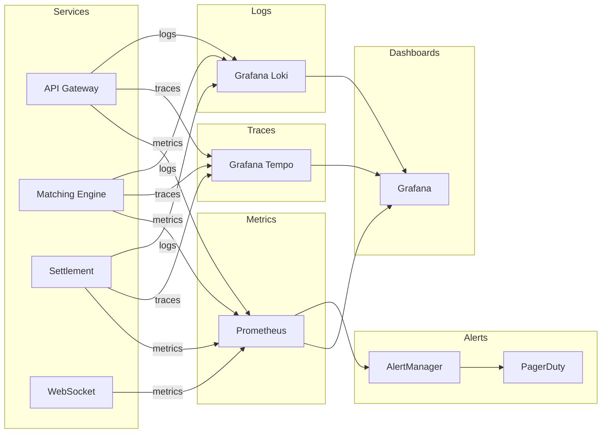

# Observability

## Overview

Comprehensive observability is critical for operating a high-performance matching engine. This document covers metrics, tracing, logging, and alerting.

## Observability Stack



## Metrics

### Metric Types

| Type | Use Case | Examples |
|------|----------|----------|
| Counter | Monotonically increasing values | Total orders, total trades, errors |
| Gauge | Point-in-time values | Order book depth, active connections, latency |
| Histogram | Distributions | Request latency, order processing time |
| Summary | Distributions (with quantiles) | Response times, trade sizes |

### Core Metrics

#### Matching Engine Metrics

```rust
use prometheus::{Counter, Histogram, IntGauge, Registry};

pub struct EngineMetrics {
    // Order metrics
    pub orders_received_total: Counter,
    pub orders_accepted_total: Counter,
    pub orders_rejected_total: Counter,
    pub orders_cancelled_total: Counter,
    pub orders_filled_total: Counter,

    // Trade metrics
    pub trades_total: Counter,
    pub trade_volume: Histogram,
    pub trade_value: Histogram,

    // Latency metrics
    pub order_latency: Histogram,
    pub match_latency: Histogram,

    // Order book metrics
    pub order_book_depth: IntGauge,
    pub order_book_spread: IntGauge,
    pub best_bid_price: IntGauge,
    pub best_ask_price: IntGauge,

    // Error metrics
    pub errors_total: Counter,
}

impl EngineMetrics {
    pub fn new() -> Self {
        Self {
            orders_received_total: Counter::new(
                "orders_received_total",
                "Total orders received"
            ).unwrap(),

            orders_accepted_total: Counter::new(
                "orders_accepted_total",
                "Total orders accepted"
            ).unwrap(),

            orders_rejected_total: Counter::new(
                "orders_rejected_total",
                "Total orders rejected"
            ).unwrap(),

            trades_total: Counter::new(
                "trades_total",
                "Total trades executed"
            ).unwrap(),

            trade_volume: Histogram::with_opts(
                HistogramOpts::new(
                    "trade_volume",
                    "Trade volume distribution"
                )
                .buckets(vec![0.001, 0.01, 0.1, 1.0, 10.0, 100.0, 1000.0])
            ).unwrap(),

            order_latency: Histogram::with_opts(
                HistogramOpts::new(
                    "order_latency_ms",
                    "Order processing latency in milliseconds"
                )
                .buckets(vec![0.01, 0.05, 0.1, 0.5, 1.0, 5.0, 10.0, 50.0, 100.0, 500.0])
            ).unwrap(),

            match_latency: Histogram::with_opts(
                HistogramOpts::new(
                    "match_latency_microseconds",
                    "Order matching latency in microseconds"
                )
                .buckets(vec![10.0, 50.0, 100.0, 500.0, 1000.0, 5000.0, 10000.0, 50000.0])
            ).unwrap(),

            errors_total: Counter::new(
                "errors_total",
                "Total errors"
            ).unwrap(),

            // ... other metrics
        }
    }

    pub fn register(&self, registry: &Registry) -> Result<(), prometheus::Error> {
        registry.register(Box::new(self.orders_received_total.clone()))?;
        registry.register(Box::new(self.orders_accepted_total.clone()))?;
        registry.register(Box::new(self.orders_rejected_total.clone()))?;
        registry.register(Box::new(self.trades_total.clone()))?;
        registry.register(Box::new(self.trade_volume.clone()))?;
        registry.register(Box::new(self.order_latency.clone()))?;
        registry.register(Box::new(self.match_latency.clone()))?;
        registry.register(Box::new(self.errors_total.clone()))?;
        Ok(())
    }
}
```

#### API Gateway Metrics

```rust
pub struct ApiMetrics {
    // Request metrics
    pub requests_total: Counter,
    pub request_duration: Histogram,

    // WebSocket metrics
    pub websocket_connections: IntGauge,
    pub websocket_messages_total: Counter,

    // Error metrics
    pub http_errors_total: Counter,
    pub rate_limit_rejected_total: Counter,
}

impl ApiMetrics {
    pub fn new() -> Self {
        Self {
            requests_total: Counter::new(
                "http_requests_total",
                "Total HTTP requests"
            ).unwrap(),

            request_duration: Histogram::with_opts(
                HistogramOpts::new(
                    "http_request_duration_ms",
                    "HTTP request duration"
                )
                .buckets(vec![1.0, 5.0, 10.0, 50.0, 100.0, 500.0, 1000.0, 5000.0])
            ).unwrap(),

            websocket_connections: IntGauge::new(
                "websocket_connections",
                "Active WebSocket connections"
            ).unwrap(),

            http_errors_total: Counter::new(
                "http_errors_total",
                "Total HTTP errors"
            ).unwrap(),

            rate_limit_rejected_total: Counter::new(
                "rate_limit_rejected_total",
                "Total requests rejected due to rate limiting"
            ).unwrap(),
        }
    }
}
```

#### Database Metrics

```rust
pub struct DatabaseMetrics {
    pub query_duration: Histogram,
    pub connection_pool_size: IntGauge,
    pub active_connections: IntGauge,
    pub query_errors_total: Counter,
    pub slow_queries_total: Counter,
}

impl DatabaseMetrics {
    pub fn new() -> Self {
        Self {
            query_duration: Histogram::with_opts(
                HistogramOpts::new(
                    "db_query_duration_ms",
                    "Database query duration"
                )
                .buckets(vec![0.1, 0.5, 1.0, 5.0, 10.0, 50.0, 100.0, 500.0, 1000.0])
            ).unwrap(),

            connection_pool_size: IntGauge::new(
                "db_connection_pool_size",
                "Database connection pool size"
            ).unwrap(),

            active_connections: IntGauge::new(
                "db_active_connections",
                "Active database connections"
            ).unwrap(),

            query_errors_total: Counter::new(
                "db_query_errors_total",
                "Total database query errors"
            ).unwrap(),

            slow_queries_total: Counter::new(
                "db_slow_queries_total",
                "Total slow queries (>100ms)"
            ).unwrap(),
        }
    }
}
```

### Metric Labels

Standard labels for metrics:

```rust
pub const LABEL_SERVICE: &str = "service";
pub const LABEL_SHARD: &str = "shard";
pub const LABEL_PAIR: &str = "pair";
pub const LABEL_SIDE: &str = "side";
pub const LABEL_ORDER_TYPE: &str = "order_type";
pub const LABEL_STATUS: &str = "status";
pub const LABEL_ERROR_TYPE: &str = "error_type";
```

## Distributed Tracing

### OpenTelemetry Setup

```rust
use opentelemetry::trace::TraceError;
use opentelemetry::global;
use opentelemetry::sdk::trace as sdktrace;
use opentelemetry::sdk::Resource;
use tracing_opentelemetry::OpenTelemetryLayer;
use tracing_subscriber::{Registry, layer::SubscriberExt};

pub fn init_tracing(service_name: &str) -> Result<(), TraceError> {
    // Create OTLP exporter
    let otlp_exporter = opentelemetry_otlp::new_exporter()
        .tonic()
        .build_exporter(
            opentelemetry_otlp::ExportConfig {
                endpoint: "http://jaeger:4317".to_string(),
                ..Default::default()
            },
        )?;

    // Create tracer provider
    let tracer_provider = sdktrace::TracerProvider::builder()
        .with_batch_exporter(otlp_exporter, opentelemetry::runtime::Tokio)
        .with_resource(Resource::new(vec![
            opentelemetry::KeyValue::new("service.name", service_name),
            opentelemetry::KeyValue::new("service.version", env!("CARGO_PKG_VERSION")),
        ]))
        .build();

    global::set_tracer_provider(tracer_provider.clone());

    // Create tracing layer
    let telemetry = tracing_opentelemetry::layer()
        .with_tracer(tracer_provider.tracer(service_name));

    // Initialize subscriber
    let subscriber = Registry::default()
        .with(telemetry)
        .with(
            tracing_subscriber::fmt::layer()
                .with_span_events(tracing_subscriber::fmt::format::FmtSpan::CLOSE)
                .with_filter(tracing_subscriber::EnvFilter::from_default_env())
        );

    tracing::subscriber::set_global_default(subscriber)
        .expect("Failed to set subscriber");

    Ok(())
}
```

### Span Creation

```rust
use tracing::{instrument, span, Level, info};

#[instrument(skip(self))]
impl MatchingEngine {
    pub async fn place_order(&self, order: Order) -> Result<Vec<Trade>, EngineError> {
        let _span = span!(Level::INFO, "place_order",
            order_id = %order.id,
            user_id = %order.user_id,
            pair_id = %order.pair_id,
            side = ?order.side,
        )
        .entered();

        info!("Placing order");

        // Get shard
        let shard = self.get_shard(&order.symbol).in_current_span().await?;

        // Match order
        let trades = shard.match_order(order).in_current_span().await?;

        info!(trade_count = trades.len(), "Order placed successfully");

        Ok(trades)
    }
}
```

### Trace Context Propagation

```rust
use opentelemetry::propagation::Injector;
use opentelemetry::global::get_text_map_propagator;

pub struct HeaderInjector(http::HeaderMap);

impl Injector for HeaderInjector {
    fn set(&mut self, key: &str, value: String) {
        self.0.insert(key, value.parse().unwrap());
    }
}

pub fn inject_trace_context(headers: &mut http::HeaderMap) {
    let propagator = get_text_map_propagator();
    let mut injector = HeaderInjector(headers.clone());
    propagator.inject_context(&get_active_span().get_context(), &mut injector);
}
```

## Logging

### Structured Logging

```rust
use tracing::{info, warn, error, debug};
use serde::Serialize;

#[derive(Debug, Serialize)]
struct OrderPlacedEvent {
    order_id: u64,
    user_id: u64,
    pair_id: u16,
    side: String,
    price: Option<String>,
    qty: String,
    status: String,
}

impl MatchingEngine {
    pub fn log_order_placed(&self, order: &Order) {
        let event = OrderPlacedEvent {
            order_id: order.id,
            user_id: order.user_id,
            pair_id: order.pair_id,
            side: format!("{:?}", order.side),
            price: order.price.map(|p| p.to_string()),
            qty: order.qty.to_string(),
            status: "placed".to_string(),
        };

        info!(
            order_id = %order.id,
            user_id = %order.user_id,
            pair_id = %order.pair_id,
            side = ?order.side,
            price = ?order.price,
            qty = %order.qty,
            "Order placed"
        );
    }

    pub fn log_trade_executed(&self, trade: &Trade) {
        info!(
            trade_id = %trade.id,
            pair_id = %trade.pair_id,
            price = %trade.price,
            qty = %trade.qty,
            maker_user_id = %trade.maker_user_id,
            taker_user_id = %trade.taker_user_id,
            "Trade executed"
        );
    }

    pub fn log_error(&self, error: &EngineError) {
        error!(
            error = ?error,
            error_type = %std::any::type_name::<EngineError>(),
            "Engine error occurred"
        );
    }
}
```

### Log Levels

| Level | Use Case | Examples |
|-------|----------|----------|
| ERROR | Errors that prevent operation | Failed to match order, database connection lost |
| WARN | Unexpected but recoverable | Order rejected, high latency |
| INFO | Normal operations | Order placed, trade executed, startup |
| DEBUG | Detailed flow | Matching algorithm steps, cache misses |
| TRACE | Very detailed | Every function call, data structure states |

### Log Sampling

```rust
use tracing::level_filters::LevelFilter;

// Sample high-frequency events
const ORDER_BOOK_UPDATE_SAMPLE_RATE: f64 = 0.01;  // 1%

fn should_log_order_book_update() -> bool {
    rand::random::<f64>() < ORDER_BOOK_UPDATE_SAMPLE_RATE
}
```

## Alerting

### Alert Rules

```yaml
# alert_rules.yml
groups:
  - name: matching_engine
    interval: 30s
    rules:
      # High order rejection rate
      - alert: HighRejectionRate
        expr: |
          rate(orders_rejected_total[5m]) / rate(orders_received_total[5m]) > 0.1
        for: 5m
        labels:
          severity: warning
        annotations:
          summary: "High order rejection rate"
          description: "Order rejection rate is {{ $value | humanizePercentage }}"

      # Matching latency high
      - alert: HighMatchLatency
        expr: |
          histogram_quantile(0.99, rate(match_latency_microseconds_bucket[5m])) > 500
        for: 5m
        labels:
          severity: critical
        annotations:
          summary: "P99 match latency too high"
          description: "P99 match latency is {{ $value }}μs (target: <500μs)"

      # Order book empty
      - alert: OrderBookEmpty
        expr: order_book_depth == 0
        for: 1m
        labels:
          severity: warning
        annotations:
          summary: "Order book is empty"
          description: "Order book for {{ $labels.pair }} has no orders"

      # Database connection pool exhausted
      - alert: DbPoolExhausted
        expr: db_active_connections / db_connection_pool_size > 0.9
        for: 2m
        labels:
          severity: critical
        annotations:
          summary: "Database connection pool nearly exhausted"
          description: "{{ $value | humanizePercentage }} of connections in use"

      # High error rate
      - alert: HighErrorRate
        expr: |
          rate(errors_total[5m]) / rate(orders_received_total[5m]) > 0.05
        for: 5m
        labels:
          severity: critical
        annotations:
          summary: "High error rate"
          description: "Error rate is {{ $value | humanizePercentage }}"

      # Engine not processing
      - alert: EngineNotProcessing
        expr: |
          rate(orders_received_total[1m]) == 0
        for: 2m
        labels:
          severity: critical
        annotations:
          summary: "Engine not receiving orders"
          description: "No orders received in the last 2 minutes"

  - name: api_gateway
    interval: 30s
    rules:
      - alert: HighApiLatency
        expr: |
          histogram_quantile(0.99, rate(http_request_duration_ms_bucket[5m])) > 1000
        for: 5m
        labels:
          severity: warning
        annotations:
          summary: "High API latency"
          description: "P99 API latency is {{ $value }}ms"

      - alert: RateLimitBreach
        expr: |
          rate(rate_limit_rejected_total[1m]) > 100
        for: 1m
        labels:
          severity: warning
        annotations:
          summary: "High rate limit rejections"
          description: "{{ $value }} rejections/sec"

      - alert: WebsocketDisconnections
        expr: |
          rate(websocket_disconnections_total[5m]) > 10
        for: 5m
        labels:
          severity: warning
        annotations:
          summary: "High WebSocket disconnection rate"
          description: "{{ $value }} disconnections/sec"

  - name: system
    interval: 30s
    rules:
      - alert: HighCpuUsage
        expr: process_cpu_usage > 0.8
        for: 5m
        labels:
          severity: warning
        annotations:
          summary: "High CPU usage"
          description: "CPU usage is {{ $value | humanizePercentage }}"

      - alert: HighMemoryUsage
        expr: process_resident_memory_bytes / 1024 / 1024 / 1024 > 8
        for: 5m
        labels:
          severity: warning
        annotations:
          summary: "High memory usage"
          description: "Memory usage is {{ $value }}GB"

      - alert: DiskSpaceLow
        expr: |
          (node_filesystem_avail_bytes{mountpoint="/"} / node_filesystem_size_bytes{mountpoint="/"}) < 0.1
        for: 5m
        labels:
          severity: critical
        annotations:
          summary: "Low disk space"
          description: "Only {{ $value | humanizePercentage }} disk space remaining"
```

### Alert Routing

```yaml
# alertmanager.yml
receivers:
  - name: 'pagerduty-critical'
    pagerduty_configs:
      - service_key: '<PAGERDUTY_KEY>'
        severity: 'critical'

  - name: 'slack-warnings'
    slack_configs:
      - api_url: '<SLACK_WEBHOOK>'
        channel: '#exchange-alerts'
        title: '{{ .GroupLabels.alertname }}'
        text: '{{ range .Alerts }}{{ .Annotations.description }}{{ end }}'

  - name: 'email-info'
    email_configs:
      - to: 'ops@example.com'
        headers:
          Subject: '[INFO] {{ .GroupLabels.alertname }}'

route:
  receiver: 'pagerduty-critical'
  group_by: ['alertname', 'cluster']
  group_wait: 10s
  group_interval: 5m
  repeat_interval: 12h
  routes:
    - match:
        severity: critical
      receiver: 'pagerduty-critical'

    - match:
        severity: warning
      receiver: 'slack-warnings'

    - match:
        severity: info
      receiver: 'email-info'
```

## Grafana Dashboards

### Dashboard: Matching Engine Overview

```json
{
  "dashboard": {
    "title": "Matching Engine Overview",
    "panels": [
      {
        "title": "Orders per Second",
        "targets": [{
          "expr": "rate(orders_received_total[1m])",
          "legendFormat": "Orders/sec"
        }],
        "type": "graph"
      },
      {
        "title": "Trades per Second",
        "targets": [{
          "expr": "rate(trades_total[1m])",
          "legendFormat": "Trades/sec"
        }],
        "type": "graph"
      },
      {
        "title": "P99 Match Latency",
        "targets": [{
          "expr": "histogram_quantile(0.99, rate(match_latency_microseconds_bucket[5m]))",
          "legendFormat": "P99 (μs)"
        }],
        "type": "graph"
      },
      {
        "title": "Order Rejection Rate",
        "targets": [{
          "expr": "rate(orders_rejected_total[5m]) / rate(orders_received_total[5m])",
          "legendFormat": "Rejection rate"
        }],
        "type": "graph"
      },
      {
        "title": "Order Book Depth",
        "targets": [{
          "expr": "order_book_depth",
          "legendFormat": "{{pair}}"
        }],
        "type": "graph"
      }
    ]
  }
}
```

### Dashboard: System Health

```json
{
  "dashboard": {
    "title": "System Health",
    "panels": [
      {
        "title": "CPU Usage",
        "targets": [{
          "expr": "process_cpu_usage",
          "legendFormat": "{{instance}}"
        }],
        "type": "graph"
      },
      {
        "title": "Memory Usage",
        "targets": [{
          "expr": "process_resident_memory_bytes / 1024 / 1024 / 1024",
          "legendFormat": "{{instance}} (GB)"
        }],
        "type": "graph"
      },
      {
        "title": "Database Connections",
        "targets": [{
          "expr": "db_active_connections",
          "legendFormat": "Active"
        }, {
          "expr": "db_connection_pool_size",
          "legendFormat": "Pool size"
        }],
        "type": "graph"
      },
      {
        "title": "NATS Lag",
        "targets": [{
          "expr": "nats_consumer_lag",
          "legendFormat": "{{consumer}}"
        }],
        "type": "graph"
      }
    ]
  }
}
```

## Health Checks

```rust
use axum::{Json, response::IntoResponse};
use serde::Serialize;

#[derive(Serialize)]
struct HealthResponse {
    status: String,
    version: String,
    uptime_secs: u64,
    checks: Vec<CheckResult>,
}

#[derive(Serialize)]
struct CheckResult {
    name: String,
    status: String,
    message: Option<String>,
}

pub async fn health_check() -> impl IntoResponse {
    let mut checks = vec![];

    // Check database
    match check_database().await {
        Ok(_) => checks.push(CheckResult {
            name: "database".to_string(),
            status: "healthy".to_string(),
            message: None,
        }),
        Err(e) => checks.push(CheckResult {
            name: "database".to_string(),
            status: "unhealthy".to_string(),
            message: Some(e.to_string()),
        }),
    }

    // Check NATS
    match check_nats().await {
        Ok(_) => checks.push(CheckResult {
            name: "nats".to_string(),
            status: "healthy".to_string(),
            message: None,
        }),
        Err(e) => checks.push(CheckResult {
            name: "nats".to_string(),
            status: "unhealthy".to_string(),
            message: Some(e.to_string()),
        }),
    }

    // Check Redis
    match check_redis().await {
        Ok(_) => checks.push(CheckResult {
            name: "redis".to_string(),
            status: "healthy".to_string(),
            message: None,
        }),
        Err(e) => checks.push(CheckResult {
            name: "redis".to_string(),
            status: "unhealthy".to_string(),
            message: Some(e.to_string()),
        }),
    }

    let overall_status = if checks.iter().all(|c| c.status == "healthy") {
        "healthy"
    } else {
        "degraded"
    };

    Json(HealthResponse {
        status: overall_status.to_string(),
        version: env!("CARGO_PKG_VERSION").to_string(),
        uptime_secs: get_uptime(),
        checks,
    })
}
```
