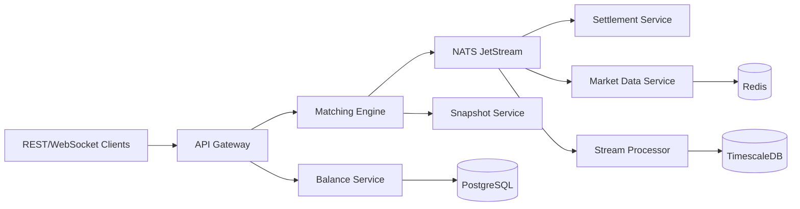

# CEX Matching Engine - Architecture Documentation

This directory contains the complete architecture design for an enterprise-grade Centralized Exchange (CEX) Matching Engine.

## Document Index

| Document | Description |
|----------|-------------|
| [00-overview.md](./00-overview.md) | High-level architecture, CQRS/Event Sourcing patterns, ADRs |
| [01-services.md](./01-services.md) | Microservice breakdown, responsibilities, APIs |
| [02-matching-engine.md](./02-matching-engine.md) | Core matching algorithm, data structures, sharding |
| [03-data-models.md](./03-data-models.md) | Database schema, Redis structures, NATS subjects |
| [04-events.md](./04-events.md) | Event flow, message contracts, sequencing |
| [05-fault-tolerance.md](./05-fault-tolerance.md) | Snapshots, WAL, recovery, failover |
| [06-security.md](./06-security.md) | Authentication, risk checks, circuit breakers |
| [07-observability.md](./07-observability.md) | Metrics, tracing, logging, alerting |
| [08-deployment.md](./08-deployment.md) | Kubernetes topology, capacity planning, operations |

## Quick Reference

### Performance Targets

| Metric | Target |
|--------|--------|
| Matching latency (p99) | < 500μs |
| Order throughput | 100,000+ orders/sec |
| WebSocket connections | 50,000+ concurrent |
| Availability | 99.99% |

### Technology Stack

| Component | Technology |
|-----------|------------|
| Language | Rust (Tokio) |
| API | Axum (REST + WebSocket) |
| Message Broker | NATS JetStream |
| Database | PostgreSQL + TimescaleDB |
| Cache | Redis |
| Numeric | rust_decimal |
| Observability | Prometheus + Grafana + Tempo + Loki |

### Order Types Supported

**Core (In-Engine)**: Limit, Market, IOC, FOK, Post-Only
**Trigger Orders**: Stop-Loss, Stop-Limit, OCO
**Advanced**: Iceberg Orders

## Architecture Diagrams

### High-Level View

## Getting Started

1. Start with [00-overview.md](./00-overview.md) for the big picture
2. Review [02-matching-engine.md](./02-matching-engine.md) for core algorithms
3. Reference [03-data-models.md](./03-data-models.md) for database schemas
4. See [08-deployment.md](./08-deployment.md) for production deployment

## Principles

1. **Security First** - All designs prioritize fund safety
2. **Correctness > Performance** - Never sacrifice accuracy for speed
3. **Zero Data Loss** - Every order, trade, and balance change is persisted
4. **Observability** - Everything is measured, traced, and logged
5. **Recoverability** - System can recover from any failure state

## Revision History

| Date | Version | Changes |
|------|---------|---------|
| 2025-05-14 | 1.0 | Initial architecture design |

## Contributing

Architecture changes should be proposed via GitHub Issues with the `design` label and `RFC:` prefix.

---

**Status**: Draft - Pending review and approval
